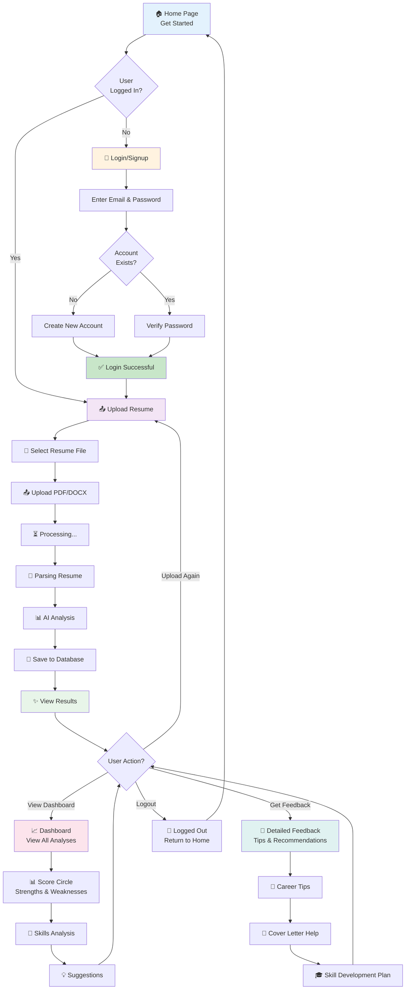

# User Flow Diagram



## How to Download:

### Option 1: Use Mermaid Live Editor (Easiest)
1. Go to: https://mermaid.live
2. Copy the entire code block above (everything after the triple backticks)
3. Paste into Mermaid Live Editor
4. Click the download icon (top right) to get PNG/SVG

### Option 2: VS Code Extension
1. Install "Markdown Preview Mermaid Support" extension
2. Open this file in VS Code
3. Right-click on the diagram → Export as PNG/SVG

### Option 3: Command Line (requires mermaid-cli)
```bash
npm install -g @mermaid-js/mermaid-cli
mmdc -i 04-User-Flow.md -o 04-User-Flow.png
```
