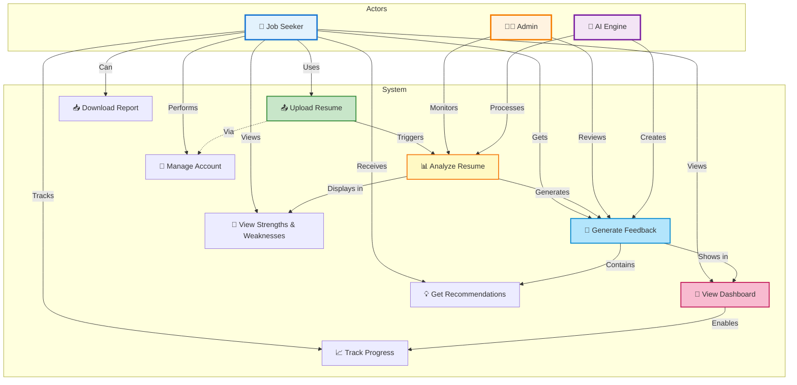

# Use Case Diagram - AI Resume Analyzer



## Use Case Description

### **Actors:**
- **Job Seeker (User)** - Primary user who uploads resumes
- **Admin** - System administrator (monitoring)
- **AI Engine** - External AI service

### **Use Cases:**

| ID | Use Case | Description | Actor |
|---|----------|-------------|-------|
| UC1 | Upload Resume | User uploads PDF/DOCX file | Job Seeker |
| UC2 | Analyze Resume | System parses and analyzes content | AI Engine |
| UC3 | Generate Feedback | AI creates detailed feedback | AI Engine |
| UC4 | View Dashboard | User views all analyses | Job Seeker |
| UC5 | Download Report | User exports analysis as PDF | Job Seeker |
| UC6 | Manage Account | User registers/login/logout | Job Seeker |
| UC7 | View Strengths & Weaknesses | User sees detailed analysis | Job Seeker |
| UC8 | Get Recommendations | User receives improvement tips | Job Seeker |
| UC9 | Track Progress | User monitors score changes | Job Seeker |

---

## How to Download:

### Option 1: Use Mermaid Live Editor (Easiest)
1. Go to: https://mermaid.live
2. Copy the entire code block above (everything after the triple backticks)
3. Paste into Mermaid Live Editor
4. Click the download icon (top right) to get PNG/SVG

### Option 2: VS Code Extension
1. Install "Markdown Preview Mermaid Support" extension
2. Open this file in VS Code
3. Right-click on the diagram → Export as PNG/SVG

### Option 3: Command Line (requires mermaid-cli)
```bash
npm install -g @mermaid-js/mermaid-cli
mmdc -i 05-Use-Case-Diagram.md -o 05-Use-Case-Diagram.png
```
